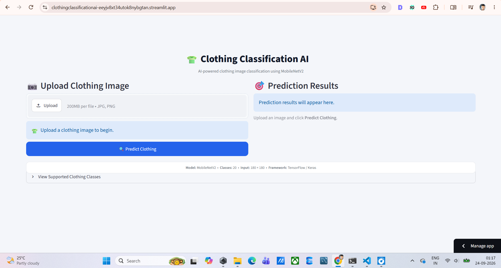
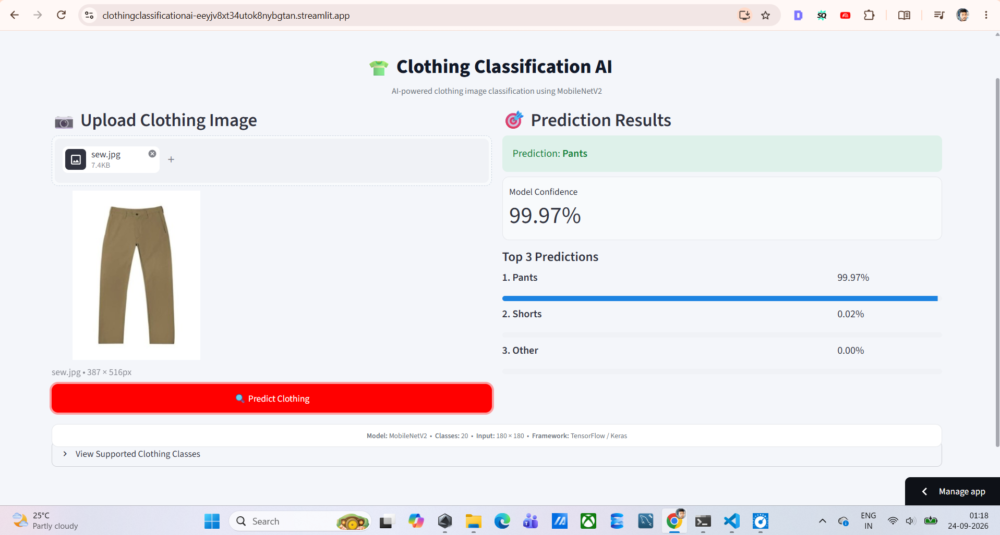
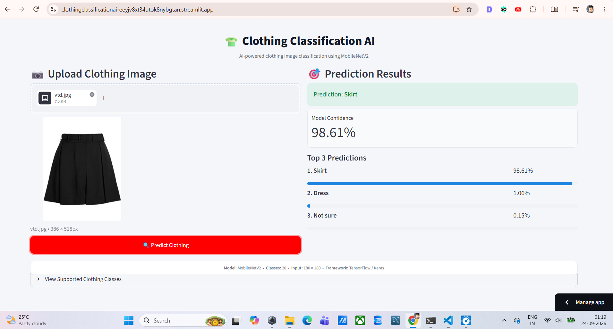
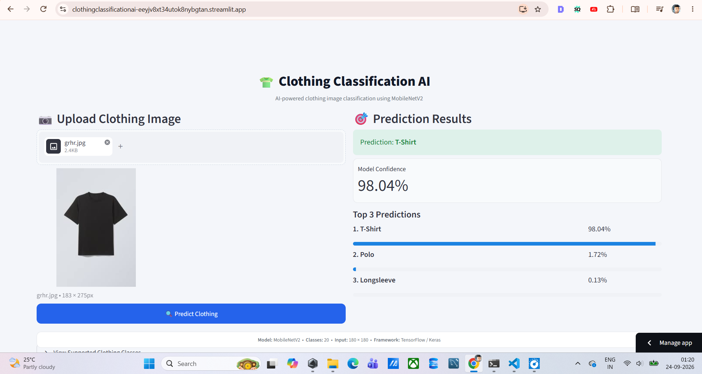
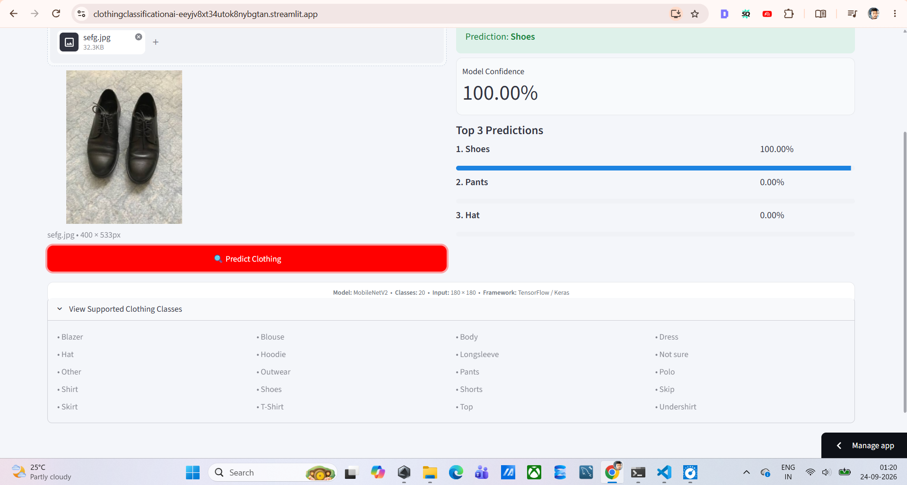

# 👕 Clothing Classification AI

[](https://www.python.org/)
[](https://www.tensorflow.org/)
[](https://keras.io/)
[](https://streamlit.io/)
[](https://github.com/)

An end-to-end **Computer Vision and Deep Learning application** for automatic clothing image classification across **20 clothing categories**.

The project covers the complete machine learning lifecycle, including exploratory data analysis, image preprocessing, class-imbalance analysis, data augmentation, CNN development, transfer learning, fine-tuning, model evaluation, model comparison, application development, Git version control, and cloud deployment.

---

## 🚀 Live Application

### 🌐 Try the deployed application

**[Launch Clothing Classification AI](https://clothingclassificationai-eeyjv8xt34utok8nybgtan.streamlit.app/)**

The web application allows users to:

* 📷 Upload a clothing image
* 🖼️ Preview the uploaded image
* 🤖 Classify the clothing category
* 🎯 View prediction confidence
* 🏆 View the top-3 predicted classes
* ⚡ Perform real-time model inference
* 🌐 Access the application directly from a browser

---

# 📌 Project Overview

Clothing image classification is a multiclass Computer Vision problem where an image must be assigned to one of several predefined clothing categories.

This project implements a complete image-classification pipeline using **TensorFlow/Keras** and compares custom CNN architectures with multiple pretrained convolutional neural networks.

The final trained model is integrated into a **Streamlit web application** and deployed using **Streamlit Community Cloud**.

### End-to-End Workflow

```text
Clothing Image Dataset
          ↓
Exploratory Data Analysis
          ↓
Data Cleaning & Validation
          ↓
Train / Validation / Test Split
          ↓
Image Preprocessing
          ↓
Class Imbalance Analysis
          ↓
Class Weight Calculation
          ↓
Image Augmentation
          ↓
CNN Baseline Models
          ↓
Transfer Learning
          ↓
Fine-Tuning
          ↓
Model Evaluation
          ↓
Model Comparison
          ↓
Final Model Selection
          ↓
TensorFlow / Keras Model
          ↓
Streamlit Web Application
          ↓
Streamlit Community Cloud
```

---

# 🎯 Project Objectives

The project focuses on building a practical and deployable Computer Vision solution capable of:

* Classifying clothing images into multiple categories
* Handling an imbalanced image dataset
* Applying image preprocessing and augmentation
* Establishing CNN baseline performance
* Evaluating transfer-learning architectures
* Comparing models using multiple evaluation metrics
* Selecting a practical model for deployment
* Creating an interactive inference application
* Deploying the application as a publicly accessible web service

---

# 👗 Supported Clothing Categories

The final classification system supports **20 classes**:

|  # | Clothing Category |
| -: | ----------------- |
|  1 | Blazer            |
|  2 | Blouse            |
|  3 | Body              |
|  4 | Dress             |
|  5 | Hat               |
|  6 | Hoodie            |
|  7 | Longsleeve        |
|  8 | Not sure          |
|  9 | Other             |
| 10 | Outwear           |
| 11 | Pants             |
| 12 | Polo              |
| 13 | Shirt             |
| 14 | Shoes             |
| 15 | Shorts            |
| 16 | Skip              |
| 17 | Skirt             |
| 18 | T-Shirt           |
| 19 | Top               |
| 20 | Undershirt        |

---

# 🖥️ Web Application

The Streamlit application provides an interactive interface for working with the trained Computer Vision model.

## Application Features

### 📷 Image Upload

Users can upload:

* JPG
* JPEG
* PNG

### 🖼️ Image Preview

The uploaded clothing image is displayed before inference.

### 🤖 AI Classification

The trained MobileNetV2 model processes the uploaded image and predicts its clothing category.

### 📊 Confidence Score

The application displays the confidence associated with the highest-probability prediction.

### 🏆 Top-3 Predictions

The application displays the three most probable clothing categories with their corresponding probabilities.

### ⚡ Lightweight Inference

MobileNetV2 provides a practical architecture for an interactive image-classification application while maintaining a relatively compact model footprint.

---

# 📸 Application Screenshots

## Clothing Image Upload



## Prediction Interface



## Prediction Results



## Application Interface





---

# 📊 Dataset

The project uses the **Clothing Dataset** containing more than 5,000 clothing images distributed across 20 categories.

### Dataset Source

**[Clothing Dataset — Kaggle](https://www.kaggle.com/datasets/agrigorev/clothing-dataset-full)**

### Dataset Characteristics

| Property          |                           Value |
| ----------------- | ------------------------------: |
| Total images      |                           5,403 |
| Number of classes |                              20 |
| Problem type      | Multiclass Image Classification |
| Input type        |                      RGB Images |
| Target            |               Clothing Category |

The dataset was explored, validated, and prepared before model training.

---

# 🔍 Exploratory Data Analysis

The project includes exploratory analysis of:

* Dataset dimensions
* Class distribution
* Number of samples per category
* Image availability
* Missing or invalid image files
* Class imbalance
* Train/validation/test distributions
* Sample clothing images

Understanding the class distribution was important because the dataset contains substantial differences in the number of samples available for individual categories.

---

# 🧹 Data Preprocessing

The image preprocessing pipeline includes:

* Image path validation
* Invalid image detection
* RGB conversion
* Image resizing
* Pixel normalization
* Stratified dataset splitting
* Batch generation
* TensorFlow data pipelines
* Prefetching

### Input Image Size

```text
180 × 180 × 3
```

RGB pixel values are normalized before being passed to the neural network.

---

# ⚖️ Class Imbalance Handling

The dataset contains significant class imbalance.

Some clothing categories contain hundreds of images, while several minority classes contain substantially fewer examples.

To address this problem, **class weights** were calculated and incorporated into model training.

This allows underrepresented classes to contribute more strongly to the training objective.

### Evaluation Metrics

Because accuracy alone can hide poor performance on minority classes, the project evaluates models using:

* Accuracy
* Macro F1
* Weighted F1

**Macro F1** is particularly useful for this problem because every class contributes equally to the metric.

---

# 🔄 Data Augmentation

Training images were augmented using TensorFlow/Keras preprocessing layers.

The augmentation pipeline includes:

* Random horizontal flipping
* Random rotation
* Random zoom
* Random translation
* Random contrast adjustment

### Purpose

Data augmentation helps improve model generalization by exposing the network to variations in the training images.

---

# 🧠 Deep Learning Approach

Two major approaches were investigated.

## 1. Custom CNN Models

CNN architectures were developed from scratch to establish baseline performance.

These models provided a reference point for evaluating the benefits of transfer learning.

## 2. Transfer Learning

Multiple pretrained CNN architectures were evaluated:

* MobileNetV2
* EfficientNetB0
* ResNet50
* VGG16

The pretrained architectures were adapted to the 20-class clothing classification problem and fine-tuned using the project dataset.

---

# 📈 Model Comparison

The following results were obtained during model evaluation:

| Model                     |     Accuracy |     Macro F1 |  Weighted F1 |
| ------------------------- | -----------: | -----------: | -----------: |
| CNN V1                    |     0.145700 |     0.091600 |     0.140900 |
| CNN V2                    |     0.387700 |     0.183100 |     0.347500 |
| MobileNetV2 Fine-tuned    | **0.723500** |     0.515400 |     0.705400 |
| EfficientNetB0 Fine-tuned |     0.704938 | **0.582266** | **0.721658** |
| ResNet50 Fine-tuned       |     0.702469 |     0.573589 |     0.717799 |
| VGG16 Fine-tuned          |     0.571605 |     0.434202 |     0.582885 |

### Evaluation Observations

* The custom CNN baselines achieved lower performance than the evaluated transfer-learning models.
* MobileNetV2 achieved the highest observed accuracy at **72.35%**.
* EfficientNetB0 achieved the highest Macro F1 score at **0.582266**.
* EfficientNetB0 achieved the highest Weighted F1 score at **0.721658**.
* ResNet50 produced comparable results to EfficientNetB0.
* VGG16 achieved lower scores across the reported evaluation metrics.

The **fine-tuned MobileNetV2** model was selected for the deployed application based on its observed test accuracy and its practical suitability for an interactive inference application.

---

# 🏆 Final Deployed Model

## MobileNetV2 Fine-tuned

The deployed model uses MobileNetV2 as the transfer-learning architecture.

### Model Pipeline

```text
Input Image
     ↓
RGB Conversion
     ↓
Resize to 180 × 180
     ↓
Pixel Normalization
     ↓
MobileNetV2
     ↓
Classification Head
     ↓
20-Class Probability Distribution
     ↓
Top Prediction + Top-3 Predictions
```

### Model Specifications

| Property       | Value                              |
| -------------- | ---------------------------------- |
| Architecture   | MobileNetV2                        |
| Approach       | Transfer Learning + Fine-Tuning    |
| Input          | 180 × 180 × 3                      |
| Output Classes | 20                                 |
| Framework      | TensorFlow / Keras                 |
| Model Format   | `.keras`                           |
| Model File     | `clothing_mobilenetv2_final.keras` |
| Application    | Streamlit                          |

---

# 💾 Model Artifact

The trained model is stored in:

```text
models/
└── clothing_mobilenetv2_final.keras
```

The class-to-index mapping is stored separately:

```text
config/
└── class_names.json
```

Separating the model artifact and class configuration makes the inference application easier to maintain and reproduce.

---

# 💻 Computing Environment

Training and experimentation were performed using both **Google Colab GPU** and a **local GPU development environment**.

## ☁️ Google Colab GPU

Google Colab GPU was used for:

* Deep Learning experimentation
* CNN training
* Transfer-learning experiments
* Fine-tuning
* Comparing multiple pretrained architectures
* Training models using GPU acceleration

## 💻 Local GPU Environment

Local development and inference testing were performed using:

| Component               | Configuration                         |
| ----------------------- | ------------------------------------- |
| GPU                     | NVIDIA GeForce RTX 3050 Ti Laptop GPU |
| VRAM                    | 4 GB                                  |
| Operating System        | Ubuntu 24.04 / WSL                    |
| Python                  | 3.12.3                                |
| TensorFlow              | 2.21.0                                |
| CUDA Driver             | 12.7                                  |
| TensorFlow CUDA Runtime | 12.6                                  |

The local GPU environment was used for:

* TensorFlow GPU verification
* Loading the trained model
* Local inference testing
* Streamlit application development
* Application debugging
* Model validation

---

# 🛠️ Technologies & Skills

## Programming

* Python

## Data Processing

* NumPy
* Pandas

## Data Visualization

* Matplotlib
* Seaborn

## Machine Learning

* Multiclass Classification
* Class Imbalance Analysis
* Class Weighting
* Stratified Train/Validation/Test Splitting
* Model Evaluation
* Performance Comparison
* Model Selection

## Deep Learning

* Convolutional Neural Networks
* Transfer Learning
* Fine-Tuning
* Image Augmentation
* Pretrained CNN Architectures
* GPU-accelerated Training

## Computer Vision

* Image Classification
* Image Preprocessing
* Image Resizing
* RGB Image Processing
* Pixel Normalization
* Image Augmentation

## Deep Learning Frameworks

* TensorFlow
* Keras

## Evaluated Architectures

* Custom CNN
* MobileNetV2
* EfficientNetB0
* ResNet50
* VGG16

## Application Development

* Streamlit
* Pillow

## Development Environment

* Jupyter Notebook
* VS Code
* Ubuntu
* WSL
* Google Colab

## Version Control

* Git
* GitHub

## Deployment

* Streamlit Community Cloud

---

# 🏗️ Application Architecture

```text
                    ┌──────────────────────┐
                    │    User / Browser    │
                    └──────────┬───────────┘
                               │
                               ▼
                    ┌──────────────────────┐
                    │    Streamlit UI      │
                    │       app.py         │
                    └──────────┬───────────┘
                               │
                               ▼
                    ┌──────────────────────┐
                    │ Image Preprocessing  │
                    │ RGB → Resize → Norm  │
                    └──────────┬───────────┘
                               │
                               ▼
                    ┌──────────────────────┐
                    │     MobileNetV2      │
                    │    Trained Model     │
                    └──────────┬───────────┘
                               │
                               ▼
                    ┌──────────────────────┐
                    │ 20-Class Prediction  │
                    └──────────┬───────────┘
                               │
                    ┌──────────┴───────────┐
                    ▼                      ▼
             Top Prediction          Top-3 Predictions
             + Confidence            + Probabilities
```

---

# 📁 Repository Structure

```text
clothing_classification_ai/
│
├── config/
│   └── class_names.json
│
├── models/
│   └── clothing_mobilenetv2_final.keras
│
├── utils/
│   ├── __init__.py
│   └── predictor.py
│
├── app.py
├── clothes.ipynb
├── requirements.txt
├── test_model.py
├── README.md
└── .gitignore
```

### File Description

| File / Directory   | Purpose                                                     |
| ------------------ | ----------------------------------------------------------- |
| `app.py`           | Streamlit web application                                   |
| `clothes.ipynb`    | Model development, experimentation, training and evaluation |
| `models/`          | Trained model artifacts                                     |
| `config/`          | Class-name configuration                                    |
| `utils/`           | Prediction-related utility code                             |
| `test_model.py`    | Local model loading and validation                          |
| `requirements.txt` | Python dependencies                                         |
| `.gitignore`       | Git exclusion rules                                         |
| `README.md`        | Project documentation                                       |

---

# 🚀 Run the Application Locally

## 1. Clone the Repository

```bash
git clone https://github.com/Sumitghodke16/clothing_classification_ai.git
```

## 2. Navigate to the Project

```bash
cd clothing_classification_ai
```

## 3. Create a Virtual Environment

```bash
python -m venv venv
```

### Linux / Ubuntu / WSL

```bash
source venv/bin/activate
```

### Windows

```bash
venv\Scripts\activate
```

## 4. Install Dependencies

```bash
pip install -r requirements.txt
```

## 5. Start Streamlit

```bash
streamlit run app.py
```

The application will then be available through the local Streamlit server.

---

# ☁️ Deployment

The application is deployed using **Streamlit Community Cloud**.

### Deployment Configuration

```text
Repository:
Sumitghodke16/clothing_classification_ai

Branch:
main

Application Entry Point:
app.py
```

### Live Application

**[Open Clothing Classification AI](https://clothingclassificationai-eeyjv8xt34utok8nybgtan.streamlit.app/)**

---

# 💡 Potential Applications

The techniques demonstrated in this project can be adapted to several real-world use cases.

## 🛍️ E-Commerce

* Automated product categorization
* Clothing catalog organization
* Product tagging
* Visual product filtering
* Inventory classification

## 🏪 Retail

* Automated inventory categorization
* Clothing product organization
* Visual product management
* Catalog automation

## 👗 Fashion Analytics

* Clothing category analysis
* Image-based product categorization
* Automated catalog metadata generation

## 👁️ Computer Vision

The same pipeline can be adapted to other multiclass image-classification problems where visual inputs need to be assigned to predefined categories.

---

# 🔮 Future Improvements

Potential improvements include:

* Increasing minority-class representation
* Additional data collection
* Hyperparameter optimization
* More extensive augmentation strategies
* Advanced fine-tuning strategies
* Confusion matrix visualization
* Per-class precision and recall analysis
* Grad-CAM explainability
* Batch image prediction
* REST API inference
* Model quantization
* CPU inference optimization
* Model versioning
* Automated testing
* CI/CD integration
* Production monitoring

---

# 📊 Evaluation Considerations

Because the dataset is imbalanced, model performance should not be interpreted using accuracy alone.

The project therefore reports three primary evaluation metrics.

### Accuracy

Measures the proportion of correctly classified images across the evaluation dataset.

### Macro F1

Calculates F1 independently for each class and then averages the class scores, giving equal importance to minority and majority classes.

### Weighted F1

Calculates F1 for each class and weights the result according to the number of samples in each class.

Using all three metrics provides a broader evaluation of multiclass classification performance.

---

# ⚠️ Limitations

The current application has several limitations:

* Performance depends on the visual quality of the uploaded image.
* Visually similar clothing categories can be difficult to distinguish.
* Some classes contain substantially fewer training examples than others.
* The model is trained on a specific clothing dataset and may not generalize equally well to every type of clothing image.
* Predictions represent model estimates and are not guaranteed classifications.
* Additional validation would be required before production use in commercial retail systems.

---

# 📚 Learning Outcomes

This project demonstrates practical experience across the complete Deep Learning lifecycle:

```text
Problem Definition
       ↓
Dataset Understanding
       ↓
Exploratory Data Analysis
       ↓
Data Validation
       ↓
Preprocessing
       ↓
Class Imbalance Analysis
       ↓
Data Augmentation
       ↓
CNN Baseline
       ↓
Transfer Learning
       ↓
Fine-Tuning
       ↓
Model Evaluation
       ↓
Model Comparison
       ↓
Model Serialization
       ↓
Streamlit Development
       ↓
Git Version Control
       ↓
GitHub Repository
       ↓
Cloud Deployment
```

The project demonstrates how a Deep Learning model can progress from experimentation in a notebook to a publicly accessible browser-based AI application.

---

# 🔗 Project Links

### 🌐 Live Application

**[Clothing Classification AI — Streamlit](https://clothingclassificationai-eeyjv8xt34utok8nybgtan.streamlit.app/)**

### 💻 Source Code

**[GitHub Repository](https://github.com/Sumitghodke16/clothing_classification_ai)**

### 📊 Dataset

**[Clothing Dataset — Kaggle](https://www.kaggle.com/datasets/agrigorev/clothing-dataset-full)**

### 👤 Professional Profile

**[LinkedIn Profile](https://www.linkedin.com/in/sumit-ghodke-a45a82205/)**

---

# 👨‍💻 Author

## Sumit Naresh Ghodke

**Data Analytics | Machine Learning | Deep Learning | AI Engineering**

[LinkedIn](https://www.linkedin.com/in/sumit-ghodke-a45a82205/) · [GitHub](https://github.com/Sumitghodke16)

---

# ⭐ Project Summary

**Clothing Classification AI** combines:

**Python + TensorFlow + Keras + Computer Vision + CNN + Transfer Learning + MobileNetV2 + Image Augmentation + Class Imbalance Handling + Streamlit + GitHub + Cloud Deployment**

The project transforms a clothing image classification model into an accessible web application that can be tested directly through a browser.
